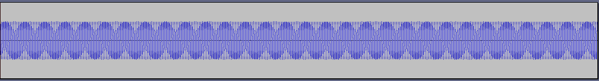
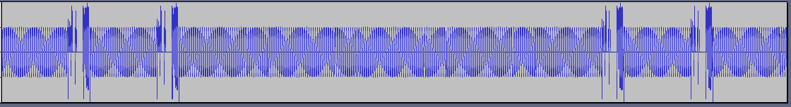
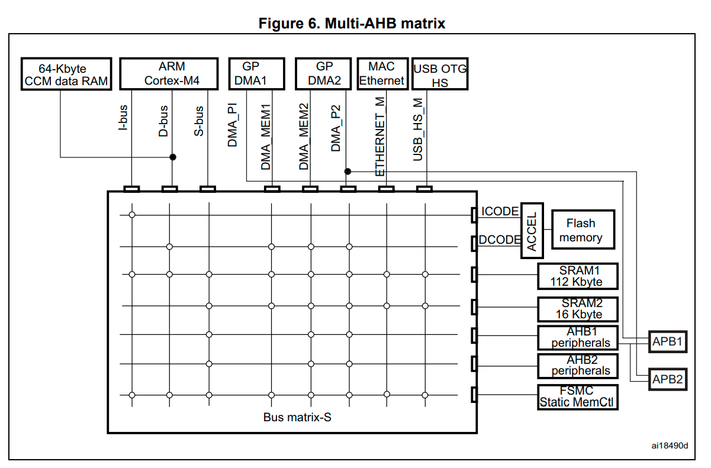

# Experimental STM32F407 FLAC Player
## Overview
Created as a project for Embedded Systems course (AGH UST).

After analysing multiple repositories created for this particular platform, it became apparent that most of the existing music players support only the MP3 format. In spite of its popularity, MP3 compromises sound quality due to its lossy compression.

FLAC, as a lossless format, does not suffer from this particular drawback and allows listener to enjoy music of high quality.

This project is an attempt at creating an experimental STM32F407 FLAC music player.

## Used hardware, software and libraries
* [STM32F407G-DISC1](https://download.kamami.pl/p561343-stm32f4disco-prod-spec.pdf) - target platform 
* [STM32Cube IDE 1.6.0](https://www.st.com/en/development-tools/stm32cubeide.html) - environment for development, debugging and source code generation
* [Moserial](https://wiki.gnome.org/action/show/Apps/Moserial?action=show&redirect=moserial#The_moserial_Project) - terminal for platform connectivity
* [libFlac](https://xiph.org/flac/) - library used to decode FLAC files
* [Audacity](https://audacity.pl/) - used to create FLAC files and analyse decoded samples

## Project development

### Creation of base project
Base code was created using STM32CubeIDE's built in CubeMX. Tests of proper mass storage configuration were conveyed using example WAVE player project.
Usage of FatFS and BSP functions would later create a foundation for our FLAC player.

### libFLAC 
After including libFLAC, it became apparent that methods of memory allocation used in the library are not compatible with our project. The `malloc` and `free` functions were relying on `sbrk`, implementation of which was auto generated by CubeMX. 

Similar errors were encountered by developers using `newlib` library. The fix proposed [here](https://nadler.com/embedded/newlibAndFreeRTOS.html), which consists of replacing the automatically generated `sbrk` with specially prepared implementation, worked also in the case of `libFlac`. As a result, `malloc` and `free` functions could be used safely throughout the project.

### Decoding FLAC
Code responsible for decoding FLAC data is implemented in `write_callback` function.

```c
for (int sample = 0; sample < samples; sample++) {
    for (int channel = 0; channel < channels; channel++) {
        for (int byte = 0; byte < bytes_per_sample; byte++) {
            flac->read_frame->data[(sample * channels + channel) * bytes_per_sample + byte] =
                (uint8_t)((buffer[channel][sample] >> (byte * 8)) & 0xFF);
        }
    }
}
```

### Encountered problems
Proposed decoding method, despite its logical correctness, seemed not to be working. Extensive tests were conveyed to identify the source of the problems. 

Using Audacity, simple sample consisting of sinusoidal wave was created. Source code was altered to save the decoded samples to a WAVE file. Saving was performed at three different stages:
* right after decoding
* right before copying data to a buffer passed to BSP functions
* right after copying data to a buffer passed to BSP functions

Data saved using the first two approaches was identical with the input signal. Only when saving the copied buffer in the third case, the saved WAVE file contained noticeable distortions. 

Signal generated in Audacity.

Decoded signal - BSP buffer saved after copying decoded contents.

As mentioned earlier, if buffer was saved right after decoding, the output file contained signal identical with the generated sample. Based on that fact, a conclusion was made that the decoding and copying of the buffer is not as fast as transmitting the data via BSP functions - data was not being supplied fast enough to be properly transmitted.

Additional test using diodes was performed. LD3 was turned on whenever the processor was busy decoding and copying decoded data. Conversely, LD4 was turned off during that time. Results confirmed that most of the time, the processor was busy with decoding-related data manipulation.
### Proposed solutions
A conclusion was made that to achieve a working player, a higher speed of data manipulation is necessary.

Our first attempt was to place the buffer in CCM memory. Linker script was edited by adding the following code in linker script:
``` 
.ccmram :
{
. = ALIGN(4);
_sccmram = .;       /* create a global symbol at ccmram start */
*(.ccmram)
*(.ccmram*)
. = ALIGN(4);
_eccmram = .;       /* create a global symbol at ccmram end */
} >CCMRAM AT> FLASH
```
Buffer declaration was annotated with `__attribute__((section(".ccmram")))`

Despite the fact that memory was successfully being allocated in CCM memory, BSP callbacks regarding half and full buffer transfer were never getting called.


Due to [STM32F407 Datasheet](https://www.st.com/resource/en/datasheet/dm00037051.pdf) even though CCM has a connection to data and instruction busses, it has no connection to DMA (more on that [here](https://electronics.stackexchange.com/questions/53827/using-ccm-core-coupled-memory-in-stm32f4xx)).

